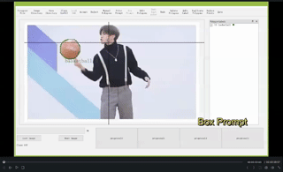

# segment-anything-annotator
We developed a python UI based on labelme and segment-anything for pixel-level annotation. It support generating multiple masks by SAM(box/point prompt),  efficient polygon modification and category record. We will add more features (such as incorporating CLIP-based methods for category proposal and VOS methods for mask association of video datasets)

Any feedback or suggestions are welcomed. We will continuously add features and fix bugs. 👀👀👀


## News
`28 Apr`: Change the output format with labelme format. If you want to use the old output format, please use `backup/annotator.py`.

`21 Apr`: Add annotation script for video dataset. See [Video Usage](https://github.com/haochenheheda/segment-anything-annotator#video-usage) for the details.

## Features
- [x] Interactive Segmentation by SAM (both boxes and points prompt)
- [x] Multiple Output Choices
- [x] Category Annotation
- [x] Polygon modification
- [ ] CLIP for Category Proposal
- [x] STCN for Video Dataset Annotation

## Demo


## Installation
  1. Python>=3.8
  2. [Pytorch](https://pytorch.org/)
  3. pip install -r requirements.txt

## Usage
### 1. Start the Annotation Platform

```
python annotator.py --app_resolution 1000,1600 --model_type vit_b --keep_input_size True --max_size 720
```
`--model_type`: vit_b, vit_l, vit_h

`--keep_input_size`: `True`: keep the origin image size for SAM; `False`: resize the input image to `--max_size` (save GPU memory)

### 2. Load the category list file if you want to annotate object categories.
Click the `Category File` on the top tool bar and choose your own one, such as the `categories.txt` in this repo.

### 3. Specify the image and save folds
Click the 'Image Directory' on the top tool bar to specify the fold containing images (in .jpg or .png).
Click the 'Save Directory' on the top tool bar to specify the fold for saving the annotations. The annotations of each image will be saved as json file in the following format
```
[
  #object1
  {
      'label':<category>, 
      'group_id':<id>,
      'shape_type':'polygon',
      'points':[[x1,y1],[x2,y2],[x3,y3],...]
  },
  #object2
  ...
]
```

### 4. Load SAM model
Click the "Load SAM" on the top tool bar to load the SAM model. The model will be automatically downloaded at the first time. Please be patient. Or you can manually download the [models](https://github.com/facebookresearch/segment-anything#model-checkpoints) and put them in the root directory named `vit_b.pth`, `vit_l.pth` and `vit_h.pth`.

### 5. Annotating Functions
`Manual Polygons`: manually add masks by clicking on the boundary of the objects, just like the Labelme (Press right button and drag to draw the arcs easily).

`Point Prompt`: generate mask proposals with clicks. The mouse leftpress/rightpress represent positive/negative clicks respectively.
You can see several mask proposals below in the boxes: `Proposal1-4`, and you could choose one by clicking or shortcuts `1`,`2`,`3`,`4`.

`Box Prompt`: generate mask proposals with boxes.

`Accept`(shortcut:`a`): accept the chosen proposal and add to the annotation dock.

`Reject`(shortcut:`r`): reject the proposals and clean the workspace.

`Save`(shortcut:'s'): save annotations to file. Do not forget to save your annotation for each image, or it will be lost when you switch to the next image.

`Edit Polygons`: in this mode, you could modify the annotated objects, such as changing the category labels or ids by double click on object items in the
annotation dock. And you can modify the boundary by draging the points on the boundary.

`Delete`(shortcut:'d'): under `Edit Mode`, delete selected/hightlight objects from annotation dock.

`Reduce Point`: under `Edit Mode`, if you find the polygon is too dense to edit, you could use this button to reduce the points on the selected polygons. But this will slightly reduce the annotation quality.

`Zoom in/out`: press 'CTRL' and scroll wheel on the mouse

`Class On/Off`: if the Class is turned on, a dialog will show after you accept a mask to record category and id, or the catgeory will be default value "Object".


## Video Usage
### 1. clone [STCN](https://github.com/hkchengrex/STCN), download the [stcn.pth](https://drive.google.com/file/d/1mRrE0uCI2ktdWlUgapJI_KmgeIiF2eOm/view) and put them in the root directory like this:
```
-| segment-anything-annotator
    -| annotation_video.py
    .....
    -| STCN
    -| stcn.pth
```

### 2. Start the Annotation Platform
```
python annotator_video.py --app_resolution 1000,1600 --model_type vit_b --keep_input_size True --max_size 720 --max_size_STCN 600
```
`--model_type`: vit_b, vit_l, vit_h
`--keep_input_size`: `True`: keep the origin image size for SAM; `False`: resize the input image to `--max_size` (save GPU memory)
`--max_size_STCN`: the maximum input image size for STCN (don't be too large) 

### 3. Specify the video and save folds
Click 'Video Directory' and 'Save Directory'.
The folds containing videos should be structured like this:
```
-| video_fold
    -| video1
        -| 00000.jpg
        -| 00001.jpg
        ...
    -| video2
        -| 00000.jpg
        -| 00001.jpg     
    ...
```
### 3. Load STCN and SAM
Click 'Load STCN' and 'Load SAM'.

### 4. Video Annotating Functions
(a) Finish the annotations of the first frame with SAM

(b) Press and hold `left control`, then press `left mouse button` to select the objects you want to track (should be highlighted by colors)

(c) Click `add object to memory` to initialize the tracklets

(d) move to next frame, and click `Propagate` to obtain tracked masks on new frame. (the results will be automatically saved when you change frames)

(e) if the propagated masks are not good enough, press 'e' to enter Edit mode, then you could manually correct the masks. You could also use `Add as key frame` to add a certain frame as reference to improve the propagation stability.

ShortCuts: `b`: `last frame`, `n`: `next frame`, `e`: `edit model`, `a`: `accept proposal`, `r`: `reject proposal`, `d`: `delete`, `s`: `save`, `space`: `propagate`


## To Do
- [ ] CLIP for Category Proposal
- [x] STCN for Video Dataset Annotation
- [ ] Fix bugs and optimize the UI
- [ ] Annotation Files -> Labelme Format/COCO Format/Youtube-VIS Format

## Acknowledgement 
This repo is built on [SAM](https://github.com/facebookresearch/segment-anything) and [Labelme]().


